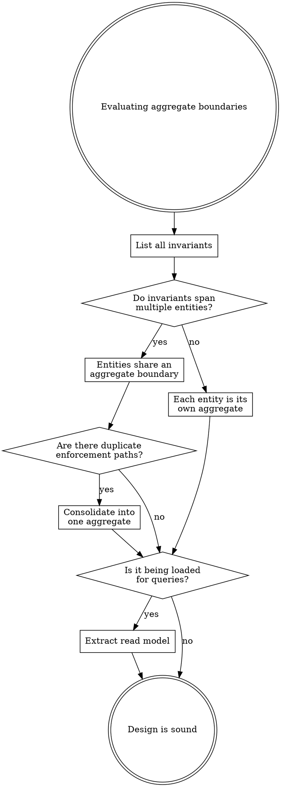

# CQRS and Event Sourcing

## Overview

**CQRS** (Command Query Responsibility Segregation): use a different model to update information than the model you use to read it. The write side enforces invariants; the read side answers questions. They are separate concerns with separate optimization needs.

**Event Sourcing**: store the sequence of events (immutable facts) rather than current state. Current state is derived by replaying events. Events are past-tense facts: `TaskAdded`, `StateUpdated`, `ContextChanged`.

These are **complementary but separate patterns**. You can use CQRS without Event Sourcing, and vice versa. Event Sourcing makes the write side append-only but makes querying impractical without read models -- hence the natural pairing.

## When to Use (and When NOT To)

**CQRS adds value when:**
- Read and write shapes differ significantly
- Multiple read models serve different consumers
- Read/write workloads have different scaling needs

**Event Sourcing adds value when:**
- Event history has intrinsic business value (audit, temporal queries)
- You need "what did this look like last Tuesday?"
- New read models must be buildable from existing data retroactively

**Warning signs of over-application** (per Greg Young):
- Event-sourcing simple CRUD with no complex invariants
- Events are just `FieldChanged { old, new }` instead of meaningful domain events
- Only one read model that mirrors the write model
- Optimizing for problems you don't have

Greg Young: "The single biggest bad thing I've seen is building an entire system on Event Sourcing." Apply selectively, per bounded context.

## Core Concepts

### Commands, Events, Queries

| Concept | Direction | Purpose | Example |
|---------|-----------|---------|---------|
| **Command** | Intent to change | Validated, may be rejected | `MarkTaskDone { name }` |
| **Event** | Fact that happened | Immutable, append-only | `TaskCompleted { name, timestamp }` |
| **Query** | Request for data | Never changes state | `ListActiveTasks` |

### Event Store vs Event Bus

An **event bus** is ephemeral notification -- events exist in memory, handlers react, events are gone. An **event store** is durable persistence -- events are the source of truth, append-only, ordered, with optimistic concurrency. You can have an event bus without an event store (event-driven architecture) or both together (event sourcing).

### Read Models / Projections

A projection subscribes to events and builds a queryable view. Key properties:
- **Derived**: rebuildable from scratch by replaying events
- **Denormalized**: optimized for specific query patterns
- **Multiple**: different projections serve different needs from the same events
- **Eventually consistent**: lag behind writes, which is usually acceptable

Read models answer questions; aggregates never should. If you're loading an aggregate to display data, extract a read model.

## Aggregate Design

**Aggregates are consistency boundaries.** Their job is to enforce invariants within a single transaction -- nothing more.

### Decision Framework

**Steps:** (1) List every invariant. (2) Map each to participating entities. (3) Entities sharing invariants share an aggregate. (4) Check for duplicate enforcement. (5) Separate reads from writes. (6) For small collections (< 1000), correctness beats optimization.

### Vernon's Four Rules

| Rule | Meaning |
|------|---------|
| **Model true invariants** | Only group entities that MUST be consistent in a single transaction |
| **Design small aggregates** | ~70% are just root + value objects; 2-3 entities max otherwise |
| **Reference by identity** | Store IDs to other aggregates, not object references |
| **Eventual consistency outside** | Cross-aggregate coordination via domain events, not transactions |

**One transaction = one aggregate.** Need two aggregates in one operation? Either they're one aggregate (shared invariant) or use eventual consistency.

### Key Heuristics

**Boundaries follow invariants, not data.** (Greg Young: "If you find yourself wanting aggregates to have relationships with other aggregates, you are modeling incorrectly. Organize in terms of behaviors, not data relationships.")

**Write-side repository is minimal:** `GetById` and `Save` only. Query methods = mixed concerns.

### Policies (Reactors)

A policy listens to an event and issues a command: **"When X happens, do Y."** Stateless, fire-and-forget. The command goes through the normal pipeline so the target aggregate still validates it.

Example: "When all children are done, mark parent done" -- policy listens for `StateUpdated`, queries children, dispatches `MarkDone` to parent if all complete.

Policies are the **glue between aggregates**. They allow aggregates to remain ignorant of each other while enabling coordinated behavior. Aggregate A emits event -> policy dispatches command to Aggregate B. Neither aggregate knows the other exists.

### Sagas (Process Managers)

A saga is a **stateful, long-running coordination process** that reacts to multiple events over time. Use instead of a policy when:
- The response requires a *sequence* of steps
- You must wait for multiple events before deciding (correlation)
- The process has intermediate states, timeouts, or compensating actions

Example: conflict resolution during sync -- detect conflict, present options, wait for user input, apply resolution, handle failures at each step.

| Aspect | Policy | Saga |
|--------|--------|------|
| State | Stateless | Stateful, persisted |
| Trigger | Single event | Multiple events over time |
| Output | Single command | Sequence of commands |
| Failure | Retry or ignore | Compensating actions |

**Critical rule:** Policies and sagas must never modify aggregate state directly. They issue commands through the command pipeline so aggregate invariants are always enforced.

## Anti-Patterns

| Pattern | Symptom | Fix |
|---------|---------|-----|
| **Dual Aggregate** | Two objects enforce the same invariant differently | Consolidate into the one with natural data access |
| **Fat Aggregate** | Loads thousands of entities for a few invariants | Challenge if invariant is real; consider eventual consistency |
| **Aggregate for Queries** | Instantiated in read-only operations | Queries bypass aggregates; read directly from storage |
| **Anemic Aggregate** | Data bag with getters/setters, no rules | Push rules in, or accept CRUD if genuinely no invariants |
| **Event-Sourced CRUD** | ES applied where current state is all that matters | Use simple storage; ES adds cost without benefit |
| **System-Wide CQRS** | CQRS applied to every bounded context | Apply per-context where read/write asymmetry justifies it |

## Sources

- Greg Young, "CQRS Documents" (cqrs.files.wordpress.com)
- Greg Young, "A Decade of DDD, CQRS, Event Sourcing" (2016 talk)
- Vaughn Vernon, "Effective Aggregate Design" Parts I-III (dddcommunity.org)
- Eric Evans, "Domain-Driven Design" (2003)
